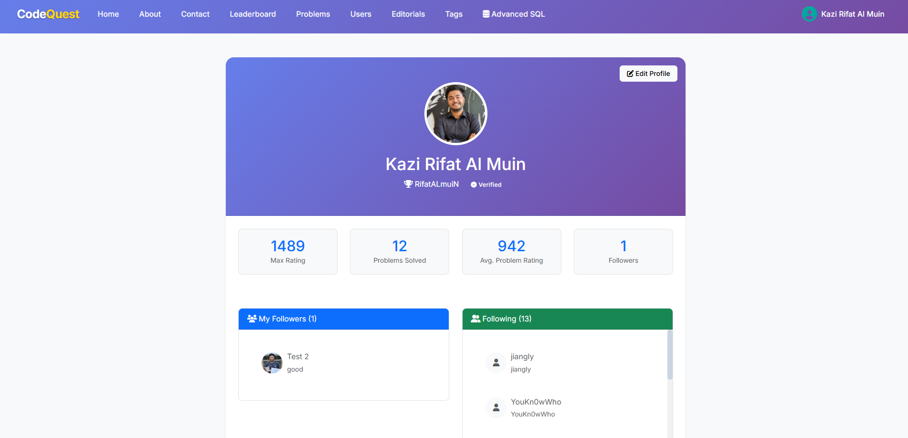

<p align="center"><a href="https://laravel.com" target="_blank"></a></p>

# CodeQuest — Publish-Ready Overview

CodeQuest is a Laravel-based platform for discovering, tracking, and discussing programming problems. It's designed for competitive programmers and problem solvers — featuring curated problems, tags, editorials, social features (follow), per-problem progress tracking, and an analytics-friendly SQL playground.

This README is optimized for publishing (e.g., GitHub or marketplace). It contains setup instructions, a concise feature tour, and a 1–20 screenshot gallery (SS01–SS20) located in `docs/screenshots/`.

Highlights
- Problem discovery with multi-criteria filtering and fast search
- Track progress per problem (unsolved / trying / solved), add notes and submission links
- Write and vote on editorials; editorial quality and upvotes are visible
- Leaderboard, user profiles, follows, and an admin dashboard with platform metrics
- SQL Quest: a safe, read-only analytics playground for the database

Table of Contents
- Quick start (Windows/XAMPP)
- Features overview
- Screenshot gallery (SS01–SS20)
- Project structure & important files
- Local development and deployment notes
- Contributing, license & contact

Quick start (Windows + XAMPP)
1. Clone the repository and install dependencies:

```powershell
cd C:\\xampp\\htdocs
git clone https://github.com/KaziRifatAlMuin/CodeQuest.git
cd CodeQuest
composer install
npm install
```

2. Configure environment and app key:

```powershell
copy .env.example .env
php artisan key:generate
# Edit .env: set DB_DATABASE, DB_USERNAME, DB_PASSWORD to your local MySQL (XAMPP) settings
```

3. Prepare database and seed demo data (uses JSON seeders included in `database/json`):

```powershell
php artisan migrate --seed
```

4. Run the app and the frontend dev server:

```powershell
php artisan serve --host=127.0.0.1 --port=8000
npm run dev
```

Features overview
- Problems: Browse, filter by tags, difficulty and popularity; star and rate problems
- User progress: Track status per problem (unsolved/trying/solved), add notes and submission links
- Editorials: Rich content with code blocks, authoring, upvotes/downvotes, and related-problem links
- Social: Follow/unfollow users and see basic activity feeds
- Leaderboard: Rank users by Codeforces max rating, solved count and average solved rating
- Admin: Dashboard with platform KPIs, user management and tag moderation
- SQL Quest: A guided, safe read-only SQL playground for analytics and exports

Screenshot gallery (SS01–SS20)

All screenshots referenced below live in `docs/screenshots/` (SS01..SS20). When you publish this repo, include the `docs/screenshots/` folder so images render on GitHub.

- SS01 — Problems list (filter, search, pagination)
	

- SS02 — Problems list (alternate view / compact)
	

- SS03 — Tags panel and multi-filter UI
	

- SS04 — Users listing & friends/follow UX
	

- SS05 — Editorials listing / editorial card
	

- SS06 — Tags cloud / trending tags
	

- SS07 — Tags list page (tag detail)
	

- SS08 — Problem detail (statement, tags, interactions)
	

- SS09 — Search results and pagination
	

- SS10 — Profile (public view) — overview
	

- SS11 — Statistics and compact admin tiles (example)
	

- SS12 — Leaderboard / top users
	

- SS13 — Quest (SQL playground) — example query UI
	

- SS14 — Quest (SQL playground) — results preview & export
	

- SS15 — Quest (SQL playground) — column selection and joins helper
	

- SS16 — Editorial detail view (full editorial with code blocks)
	

- SS17 — Admin Dashboard — overview & KPIs (1)
	

- SS18 — Admin Dashboard — moderation lists & charts (2)
	

- SS19 — Profile (own account) — Problems tab and quick actions (1)
	

- SS20 — Profile (own account) — Settings & editorials tab (2)
	

Project structure & important files
- `app/Models/` — Eloquent models (User, Problem, Editorial, UserProblem, Tag, Friend)
- `app/Http/Controllers/` — controllers for site, problems, editorials, account, admin
- `resources/views/` — Blade views, components, and partials
- `database/migrations/` — schema definitions
- `database/seeders/RawDataSeeder.php` — loads demo data from `database/json/`
- `database/SQL/` — optional SQL views and helper procedures for analytics

Developer notes
- The `UserProblem` model uses timestamps and `solved_at` to sort history and calculate user aggregates. Model events update problem and user aggregates; be careful when changing these flows.
- Editorials support rich HTML/Markdown. When changing editor sanitization, validate XSS protections.

Production deployment tips
- Use a managed MySQL instance with daily backups. Enable strict SQL mode for consistent behavior.
- Configure queue workers for background tasks (notifications, editorial processing) and set up a cron for scheduled jobs.
- For static assets and larger user bases, build assets with `npm run build` and serve them via a CDN or dedicated static host.

Contributing
- Pull requests welcome. Keep changes small and focused. Add tests for controller logic and migrations when possible.
- If you update database structure, add migrations and, if needed, update `database/json/` seed files used by `RawDataSeeder`.

License & contact
- MIT License — see `LICENSE` (or add one if missing).
- Maintainer: KaziRifatAlMuin (GitHub). For questions or commercial licensing, open an issue or email the repo owner.

Acknowledgements
- Built with Laravel and contributions from small helpers and libraries listed in `composer.json` and `package.json`.

---

If you'd like, I can also:
- produce a `README_publish.md` with a shorter marketing blurb and badges for a public project listing, or
- generate a small CONTRIBUTING.md and a quick script to export the `docs/screenshots/` folder into a release zip.

- Return paginated problems, user stats, and search results.

**Where to edit**
- Controllers: any controller methods that return JSON (look for `return response()->json(...)` or API-specific controllers)
- Routes: `routes/web.php` may include some API-like routes; check `routes/api.php` if present.

**Notes**
- Ensure API endpoints are properly rate-limited and authenticated where needed. If transforming data shapes, prefer Resource classes (Laravel API Resource) for consistent outputs.

---

### Developer Notes & Quick Links

Quick references to files that control major features:

- Home: `app/Http/Controllers/SiteController.php`
- Problems: `app/Http/Controllers/ProblemController.php`, model `app/Models/Problem.php`
- User problems (solving, rating, starring): `app/Http/Controllers/UserProblemController.php`, model `app/Models/UserProblem.php`
- Editorials: `app/Http/Controllers/EditorialController.php`, model `app/Models/Editorial.php`
- Tags: `app/Http/Controllers/TagController.php`, models `app/Models/Tag.php`, `app/Models/ProblemTag.php`
- Quest playground: `app/Http/Controllers/QuestController.php`
- Helpers: `app/Helpers/RatingHelper.php`, `app/Helpers/SearchHelper.php`
- Routes: `routes/web.php`
- Database seeds and JSON fixtures: `database/seeders/RawDataSeeder.php`, `database/json/`
- Advanced SQL artifacts: `database/SQL/3_advanced_features.sql`

Edge cases and safety
- Quest functionality: never bypass the column count and sanitization checks.
- Bulk operations (e.g., recalculating ratings) should be queued where possible to avoid long request times.
- When using raw SQL, always sanitize inputs or use parameter binding to avoid injection risks.